# README

## Links 

### Link to Website 

Client side: https://github.com/IraShy/Shorties-app-client

Back end: https://shorties-server.herokuapp.com

### Test users to start test website contents:

teacher Alice:  email: "teacher1@g.com", 
                password: "shorties730", 

teacher Winter:  email: "teacher2@g.com",
                 password: "shorties2020730",

student Harry:   email: "test2@g.com",
                password: "730test2",

student Sam:  email: "test3@g.com", 
              password: "730test3"

### Link to Repo

Client side repo: https://github.com/IraShy/Shorties-app-client

Server side repo: https://github.com/jishan33/Shorties-app-server

### Link to manual testing spreadsheet
https://docs.google.com/spreadsheets/d/1vV4mRKybSfsh1ajtmJ3ckVwjlnzvinrlzmNVncFHiQI/edit?usp=sharing

## Instruction for Setup 

### System Dependencies

#### Rails 
- rails 6.0.3
- bundler 2.1.2

#### React 
- react-scripts 3.4.1
- yarn 1.22.4

### Credentials 

#### Rails
```
aws:
  access_key_id: <secret>
  secret_access_key: <secret>

recaptcha:
  site_key: <secret>
  secret_key: <secret>

```
To regenerate credentials, follow [these steps](https://gist.github.com/db0sch/19c321cbc727917bc0e12849a7565af9).


#### React
- create .env file in the root of the front-end project, add the following line:
```
REACT_APP_BACKEND_URL=https://shorties-server.herokuapp.com
```
- create .env.development in the root of the front-end project, add the following line:
```
PORT=8080
REACT_APP_BACKEND_URL=http://localhost:3000
```

## Running Code & Tests
### Rails
 - To install dependencies   `bundle install`
 - To run the tests   `./bin/rspec`
 - To start the app   `rails s`

 ### React
  - To install dependencies  `yarn install`
  - To run the tests  `yarn run e2e`
  - To start the app  `yarn start`

## Libraries 

### Rails 
 - RSpec 
 - Factory Bot Rails
 - Knock
 - JWTs
 - Cors
 - Recaptcha
 - Aws

 ### React 

 - Context
 - Cypress 
 - React Router Dom
 - React ReCaptcha Google
 - Lodash
 - Prop Types
 - moment
 - React Bootstrap
 - Joi browser
 - React Select
 - SASS
 - React Animations


 
## Link to postman 

  https://documenter.getpostman.com/view/10733565/T1DteFk7?version=latest

### Developer journal

We organised 2 Trello boards, one for each part of the project. 

For part A, we made screenshots every day as per requirements to document our progress. For part B, after having discussed this matter with the teachers, we did not do screenshots but started documenting our project in an additional list on Trello, just briefly listing what we did every day.

**Part A**

In the documentation phase of the project, we started from thinking about ideas. Jishan organised Trello boards for both parts, and both of us took part in adding sources and links to help us with the tasks.

We presented and discussed our ideas on Monday, and after agreeing on the Shorties idea and discussing it with the teachers, we delegated tasks.

Jishan made application architecture diagram and wireframes for desktop, notepad, and mobile.

Iryna wrote user stories and made dataflow diagram.

Both of us worked on ERD, and Jishan made sure we were on the same page about our database and models needs, as at first we had different understanding of what they should be.

Readme.md for the first part is also the result of our mutual work.

We discussed the features we wanted to implement in the project and adjusted our documentation accordingly.

**Part B**

Work on Part B of the project started 15.07.2020.

To navigate between tasks, we had coding and testing parts in our board.
Lists that we had:
- "to do" lists: TO DO (React), TO DO (Rails), TO DO (Test)
- "doing" lists: IN PROGRESS - for coding, DOING (TESTS)
- "review" lists for code and tests
- "done" lists for code and tests
- BLOCKING list
- EXTRA list - for ideas to implement if we have time after finishing what we planned
- RESOURCES list - links to all resources we needed to work on the project, e.g. to GitHub repos and Help Trello board
- Dev Journal list to document day-to-day progress

We followed a colour-blocking scheme we agreed upon, so each team member could easily see what the other one is doing at the moment.


15.07

- Jishan organised server-side repository, Iryna organised client-side repository on GitHub
- Created and tested models
- Jishan, as the server-side repo owner, organised S3 bucket and deployed to Heroku
- Iryna deployed to Netlify
- Knock authentication - done through pair programming
- Started planning what components we'll need in React, created initial list which was later updated
- Came up with the app name
- Set up RSpec for tests in Rails
- Started adding initial components to client side

16.07
- Continued TDD in Rails, testing and writing code for controllers
- Request Tests ( Note, Cohort, Category, Status )
- Authentication Test 
- Controller Tests ( Note, Cohort, Category, User )


17.07
- Tests Revision
- Authentication in React: login, signin, protectedroutes, context
- Bootstrap and SASS installation
- Set up Cypress for tests in React
- Continue working on components in React: Login, Signup, ProtectedRoute

18.07
- Jishan started adding styling
- Fixed Context
- Notes

19.07 (Sunday)
Wireframe revision 

20.07
- Search functionality implemented by Iryna
- Delete function on AddNote
- Rails tests - Jishan continued updating tests throughout the project lifecycle
- Multi-select drop down in AddNote implemented by Jishan

21.07
- Iryna attempted to implement pictures uploading (initial plan was to have many pictures attached but was changed to 1 picture)
- Show in react completed 
- Update in react in progress

22.07
- Fixed image upload - Iryna
- EditNote can edit note and its own categories in one form - Jishan worked on CreateNote and AddNote
- Fixed the note request tests after the EditNote updated 

23.07
- Completed image edit feature - Jishan had a lot to do with the add and edit parts as we have the many categories feature
- Fixed the related RSpec request tests 
- Added pagination and marked as completed features added - Jishan
- Completed cypress login and signup tests - Iryna

24.07
- extracted dropdown components from AddNote and EditNote
- form validations in progress - Jishan
- AddCohort functionality with multiple users (students) implemented by Iryna
- Cohorts component - Iryna
- git conflicts and debugging - both members throughout the project

25.07 (Sunday)
- AddCohort finished 
- Started doing Cohorts and ShowCohort components

26.07
- Cohorts 
- ShowCohort and removing stuidents from a cohort
- started doing Categories
- Iryna created the second protected routes file in an attempt to minimize unnecessary fetch requests tot the server side, but eventually the protected route files were combined as we needed to send various requests simultaniously at some point

27.07
- Form validations: AddNote and EditNote
- Code refactoring
- ShowCategory
- Signup redirect
- Share notes functionality
- Styling: Categories, ShowCohort
- Added Recaptcha

28.07
- Add styling on ( Notes, AddNote, EditNote, ShowNote, ShowCategory, Login, Signup ) for mobile version. 
- Fixed validation & login test. 
- Created Spreadsheet with test cases for manual testing
- Iryna executed test cases in development environment, documented bugs
 
 29.07
- Updated notes styling
- Added popover and alerts for buttons 
- Added completedNotes section 
- Fix bugs
- Home page - content and styling
- Debugging
- Re-testing in development after debugging

30.07
- Debugging
- Deploying and re-deploying
- Manual testing in development
- Minor fixes
- Documentation

Generally, tasks were divided mostly as follows:

Jishan worked on authentication-related problems, including form validations and recaptcha; Notes (the most difficult, significant and time-consuming part of the project) - creating, editing, rendering, sharing; and its related Rspec testing in Rails.

Iryna worked on Cohorts and Categories, implemented search feature and image uploading. Iryna did some testing in React and manual testing in development and production.

Styling: team members added styling to the parts they worked on, and polished everything together. 


# Shorties App


###### Image by <a href="https://pixabay.com/users/geralt-9301/?utm_source=link-attribution&amp;utm_medium=referral&amp;utm_campaign=image&amp;utm_content=607479">Gerd Altmann</a> from <a href="https://pixabay.com/?utm_source=link-attribution&amp;utm_medium=referral&amp;utm_campaign=image&amp;utm_content=607479">Pixabay</a>
## Description

**Purpose**

The website is to help coder students keep and find quick helpful references for the study material, such as which command to run in a certain situation, or what parameters or properties to use, etc. This is kind of a reference work for novice coders.

The application should help students with time management: they don't need to go through the entire class notes to find a particular reference - they have everything gathered in one app.

Contents has two parts: created by teachers and shared with all students, and personal additions. Teachers can control their content only. Users have full control over their own content, and they can hide teachers content if they don't need it. Students' content is confidential, i.e. only the author can see and change their notes.

**Functionality / features**

We had a lot of discussion regarding features and functionality, and every time there was something new to discuss. It helped us understand the future app much better as we were trying to see how it would function in different situations.

Shorties app allows two types of users: common users (students) and admin users (teachers). Teachers can form cohorts. 

1. **Categories.** All users can add categories. 

2. **CRUD functionality.** All users are able to add notes and assign them to categories, and edit and delete their own notes.

3. **Share.** Teachers can share categories and notes with cohorts. Teachers can also unshare notes.

4. Students are able to create, update, and delete their own categories.

5. Students can add their own notes to any category they want (their own and shared categories). 

6. **Hiding a note feature.** A student can mark a shared note as completed, this will make the note invisible for the student.

7. **Pictures.** Users are able to upload pistures, the app uses AWS S3 bucket to store the pictures.

8. **Searching.** Users are able to search for a note.


**Extra Features**

These features will be implemented if timeframe allows.

- Slack integration 
- Favorite category 


**Target audience**

Target audience is computer science students, coder students, including coding bootcamp students.

The application can also be easily utilised at a working place, with junior developers as target audience.


**Tech stack**

The application is created using Ruby on Rails for server side, React for client side, and Postgresql as a relational database. The RSpec is used for rails testing. 


**Third party services**

- Netlify
- Heroku
- Amazon S3 bucket
- reCAPTCHA


---
## Dataflow Diagram

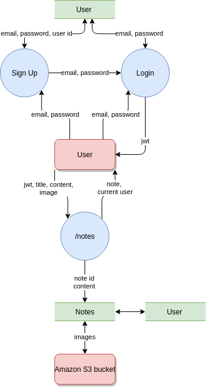

---
## User stories


###### Image by <a href="https://pixabay.com/users/Gogry-306554/?utm_source=link-attribution&amp;utm_medium=referral&amp;utm_campaign=image&amp;utm_content=4320498">Jonggun Go</a> from <a href="https://pixabay.com/?utm_source=link-attribution&amp;utm_medium=referral&amp;utm_campaign=image&amp;utm_content=4320498">Pixabay</a>
### **Sam**
Sam is a new Coder Academy student, he started his Fast Track course a month ago, switching from a hairdressing job. He is following his old dream and is proud of himself and even a bit surprised how well he is doing. He has learned a lot! But it gets confusing at times.

They started learning HTML and CSS. Sam finds it challenging to remember what commands go where with the flexbox. It is not easy indeed, one of Sam’s classmates even started dabbing! By the end of the week, Sam is feeling more and more confused.
“Should I use inline-block or flex-box? What was changing with flex-direction again? Will I ever be able to remember all this? I really need to make a cheat sheet!”

There is an app he can use - *Shorties*. It allows teachers to add some helpful bits and pieces for students to refer to. Also, students are able to create their own notes and cheat sheets, and add to existing or new categories.

### **Sam’s stories**
1. As a student user, I want to be able to see content that my teachers shared with my cohort.
2. As a student user, I want to be able to hide that content if I don’t need it anymore, so that my notes only contain what I need.
3. As a user, I want to be able to easily navigate through the app.
4. I want the app to be intuitive; at every step of using it, I want to understand what I should do.


### **Harry**

Harry is Sam’s classmate in Coder Academy. He continues working part-time while studying and is always in a rush. Harry is married with two kids and is not able to remember his own name by the end of the week.

He understands material and generally does pretty well, although he forgets some routines and has to search for them in his lesson notes over and over again. He says to his wife: “My brain is like a sieve, I am always forgetting something! I really need to have all my cheat sheets and shortcuts somewhere in one place, looking for them is taking forever.”

### **Harry’s stories**
1. As a student user, I want to be able to create new categories, so that I am not limited by shared categories.
2. As a student user, I want to be able to add my own custom notes and images to any category I want, so that my content is as useful to me as possible.
3. As a student user, I want to be able to edit and delete my own notes.
4. As a user, I want to be able to search for a particular note, so that I don't have to spend too much time browsing the app.
5. As a student user, I want to log in and out.
6. I want to only be able to see my notes when I am logged in, so that only I have access to my notes.


### **Alice**

Alice is a teacher at Coder Academy. She used to be a bootcamp student and remembers very well how overwhelming the amount of information can be. 

She needs a cheat sheet app to help her students keep all the relevant shortcuts together. Alice doesn’t want it to be another Canvas or anything massive, it should be just a quick reference to help students recall a particular command or routine. 

### **Alice’s stories**

1. As an admin and a teacher user, I want to be able to login securely to my account.
2. As a teacher user, I want to be able to create a cohort and add other users to the cohort.
3. As a teacher user, I want to be able to create categories and add notes to the categories.
4. As a teacher user, I want to be able to share and unshare the notes and categories with a cohort.
5. As an admin user, I want to be able to edit and delete shared notes and categories.
6. As an admin, I want other (non admin / teacher) users to not be able to edit or delete shared notes, so that shared content stays reliable and adequate.


###### Image by <a href="https://pixabay.com/users/Gogry-306554/?utm_source=link-attribution&amp;utm_medium=referral&amp;utm_campaign=image&amp;utm_content=4320495">Jonggun Go</a> from <a href="https://pixabay.com/?utm_source=link-attribution&amp;utm_medium=referral&amp;utm_campaign=image&amp;utm_content=4320495">Pixabay</a>

We reviewed and discussed our user stories several times as a team and added some additional stories and benefits to represent the app features from different users' point of view.

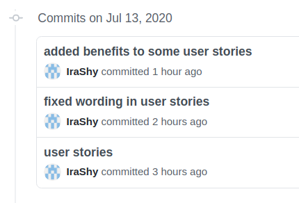

---
## Application Architecture Diagram

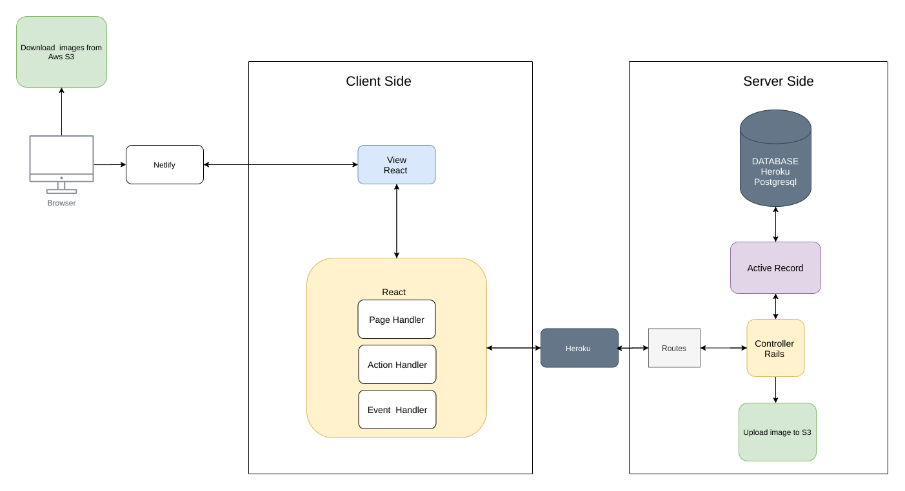

---
## Wireframes 

### Mobile Version
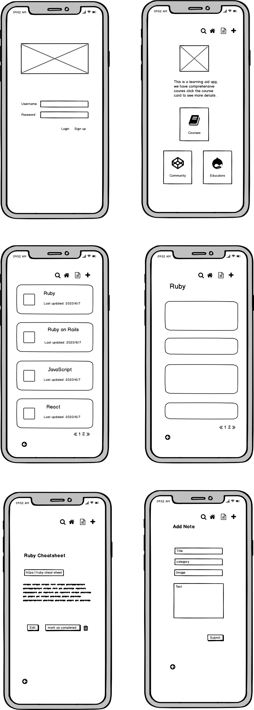


### Webiste Version
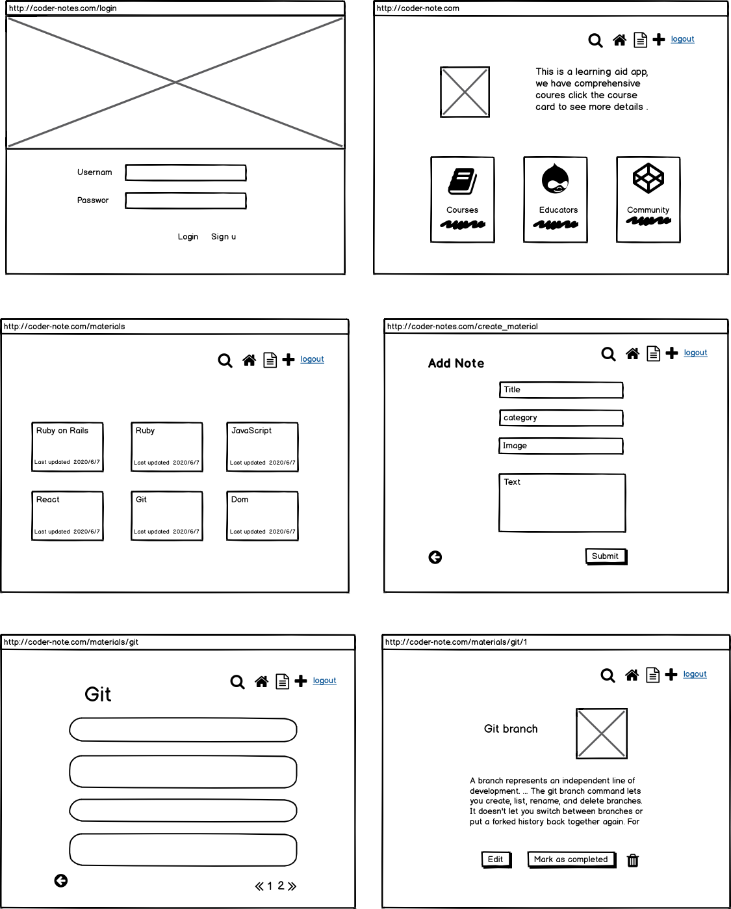

### Ipad Version
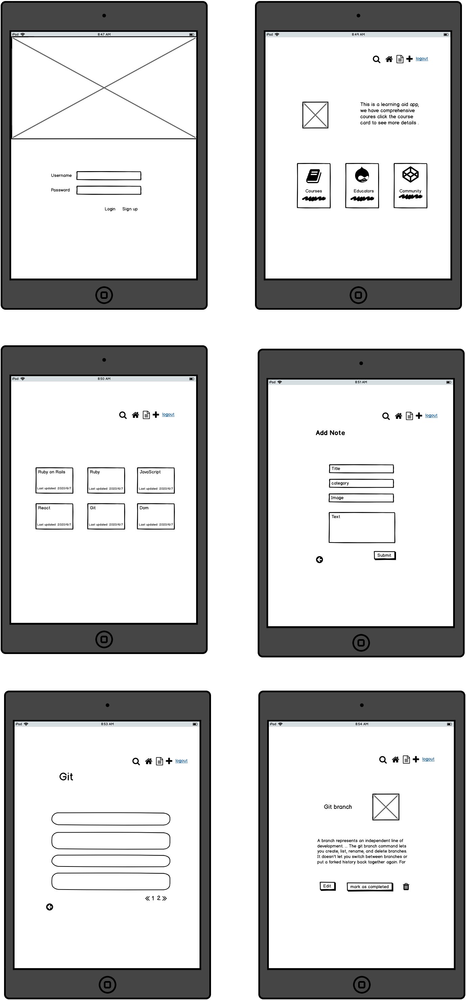

## Admin Differences

### Mobile Version 
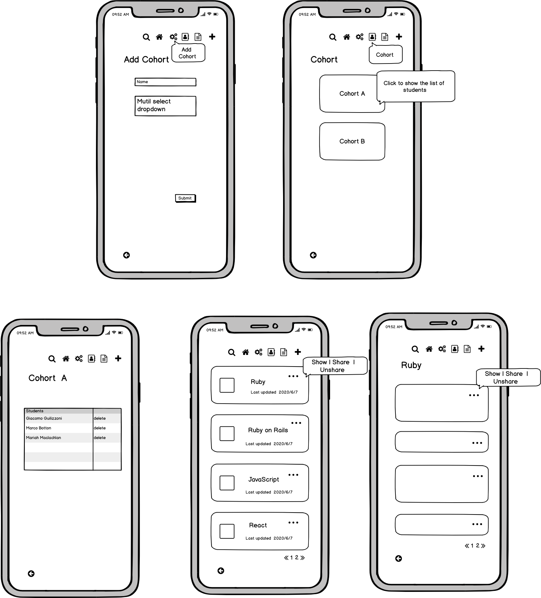

### Website Version 
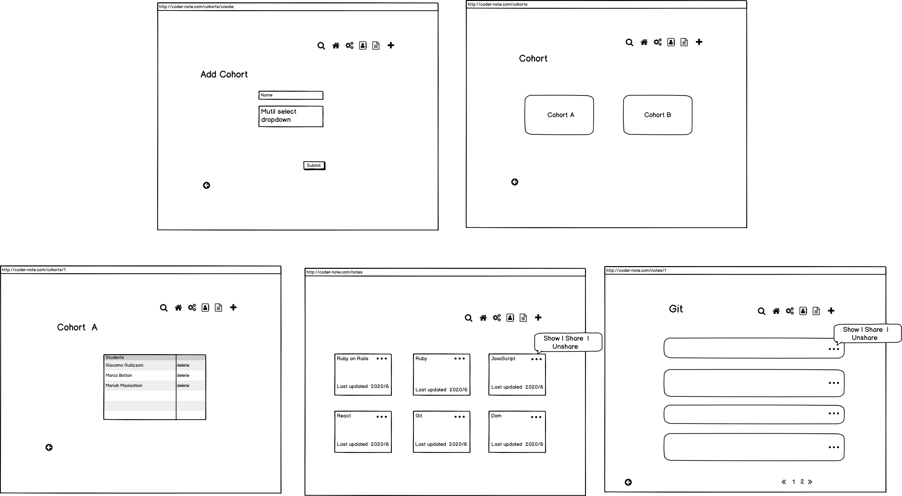

### Ipad Version 
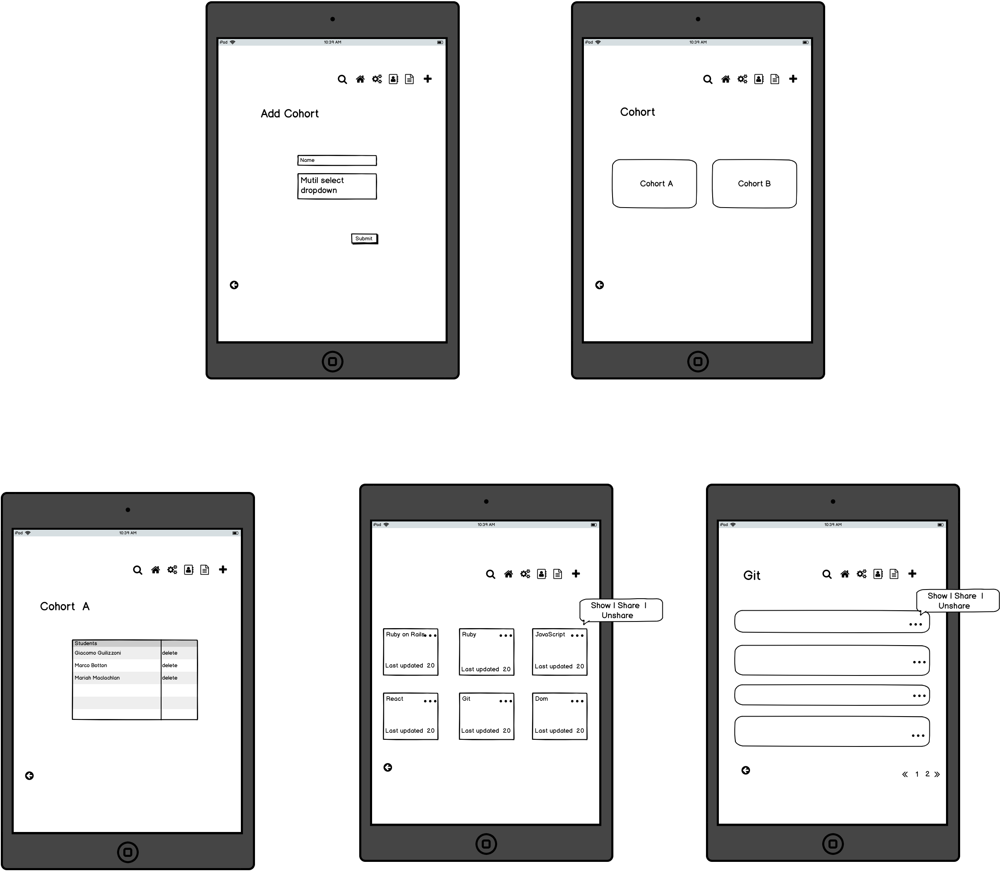

The wireframes have been revised after reviewing user stories, the original idea of making some notes (the materials passed down from educators)invisible has been changed to mark the note as completed, hence it will not show up in the notes' feed, unless you search for it. 

The reason for changing invisible to completed is that the logic for the code will be more clear and resuable as the completed note can be recovered when you filter the note with mark as completed.


---

## Trello board daily screenshots

Day 0, Friday 9 July
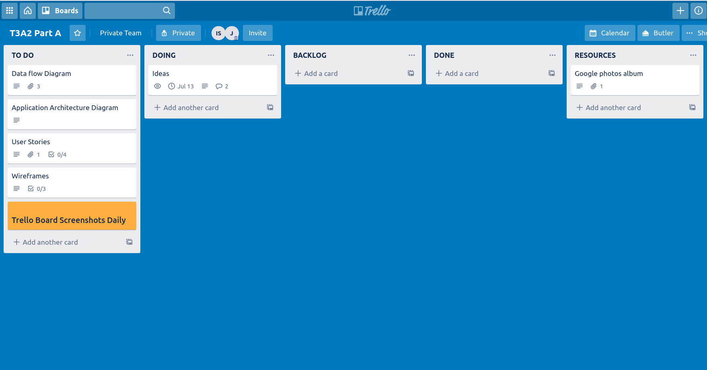

Day 1, Monday 13 July
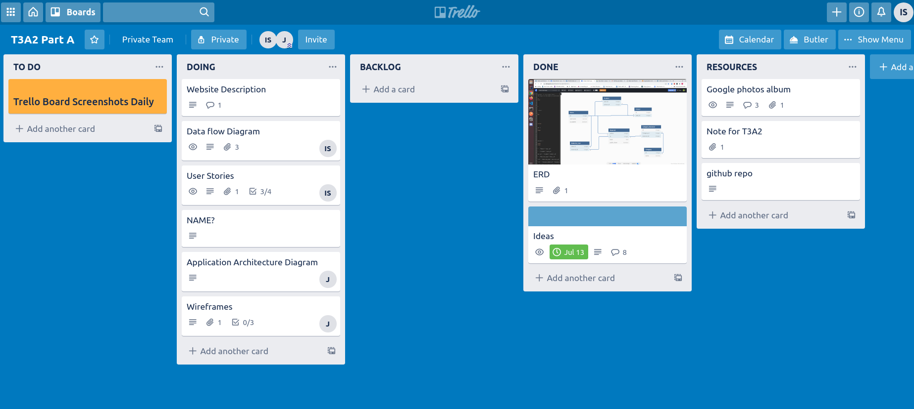

Day 2, Tuesday 14 July
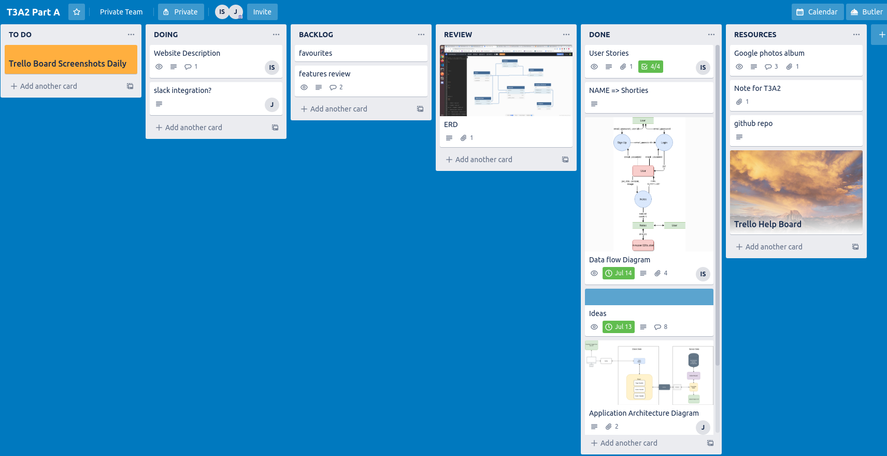

Day 3, Wednesday 15 July
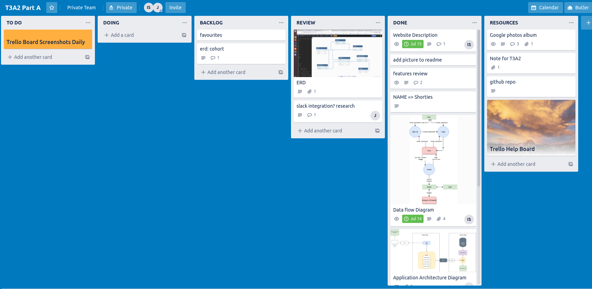


